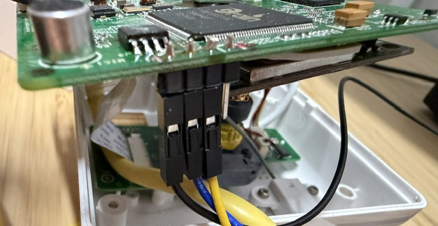

# Gigaset Elements Camera


Open tooling for keeping discontinued Gigaset/Y-cam Gen1 cameras useful on a
local network after the vendor cloud shutdown.

The repository intentionally contains **no vendor firmware, flash dump,
certificate, serial number, MAC address or device configuration**. Each user
reads their own camera, builds a device-specific patched image locally, and
keeps their original dump as the recovery copy.

## What is included

- a read-only 8 MiB SPI-flash dumper that runs from MyLoader RAM;
- a source-only firmware patcher and partition-image builder;
- an on-camera local dashboard with live view, motion-zone editor, settings,
  security page and factory-reset recovery;
- cloud disabled by default, with the stock cloud/proxy page still available;
- authenticated Telnet using the configurable root password;
- a stock-camera cloudless manager that needs only IP and MAC address;
- an optional Home Assistant MQTT add-on. MQTT never becomes a firmware
  dependency.

Hardware validation was performed on two independent Gigaset Gen1 cameras with
W25Q64FV flash and firmware `1.10 (build 20140802)`. Four reads of the second
camera were stable; two independent MyLoader reads were byte-for-byte equal.

## Safety model

The dumper payload is assembled from the included 264-byte ARM source and
loaded at `0x00008000`. It calls MyLoader's own flash-read and UART routines and
contains no erase or write operation.

The installer writes only MyLoader partition 1 (`0x00020000-0x007dffff`). It
does not overwrite the loader, partition table or the two persistent
configuration partitions. Still, keep two matching full dumps before writing
and verify their SHA256 hashes.

The original web interface is HTTP-only. Use the camera on a trusted or
isolated LAN and choose unique admin/root passwords.

## Hardware and host requirements

- a 3.3 V USB-UART adapter connected to GND, RX and TX;
- camera Ethernet connected directly to a PC or an isolated switch;
- Python 3.9 or newer;
- Windows: Npcap with raw-packet support;
- the physical MAC address of the PC Ethernet adapter;
- the camera MAC address printed on its label.

Never connect a 5 V UART signal to the camera.

### UART wiring



The wire colours in the photo refer to the **camera side**:

| Camera wire | Camera signal | Connect to USB-UART |
| --- | --- | --- |
| black | GND | GND |
| yellow | TXD | RXD |
| blue | RXD | TXD |

Use 3.3 V logic and connect only GND, TXD and RXD. Do **not** connect the
adapter's VCC/power pin; power the camera from its normal supply.

```powershell
python -m pip install -r requirements.txt
```

## 1. Read a stock camera without desoldering

Build the auditable RAM payload:

```powershell
python .\build_payload.py
```

Connect UART at 115200 baud and run the raw-Ethernet dumper. It does not require
changing the PC adapter's IPv4 address:

```powershell
python .\bootloader_dump_raw.py `
  --host-mac 98:76:54:32:10:00 `
  --uart-port COM3 `
  --output camera-read-1.bin
```

Power-cycle the camera when prompted. Repeat the read to a second file:

```powershell
python .\bootloader_dump_raw.py `
  --host-mac 98:76:54:32:10:00 `
  --uart-port COM3 `
  --output camera-read-2.bin

Get-FileHash -Algorithm SHA256 .\camera-read-1.bin, .\camera-read-2.bin
```

Do not continue unless both files are exactly 8,388,608 bytes, contain
`GM8126` at offset 0 and `MEF 7f` at `0x20000`, and have equal hashes.

## 2. Build the local-manager image

These commands use only the dump read from that camera:

```powershell
python .\firmware_tools\extract_mef.py `
  .\camera-read-1.bin .\camera-original.mef

python .\firmware_tools\patch_oncamera_manager.py `
  .\camera-original.mef .\camera-local-manager.mef `
  --mac 7C:2F:80:00:00:00

python .\firmware_tools\build_manager_flash.py `
  .\camera-read-1.bin .\camera-local-manager.mef `
  .\camera-local-manager-full.bin `
  --partition-output .\camera-local-manager-partition1.bin
```

After creating the patched MEF, the script prints the camera MAC, the `admin`
user's derived web password and the default `root:root` credentials. Save this
output before installing the image.

All generated `.bin`, `.mfw` and dump files are ignored by Git.

## 3. Install partition 1 through MyLoader

Prepare the loader. Power-cycle the camera when prompted:

```powershell
python .\firmware_tools\uart_loader.py prepare --port COM3
```

In a second terminal, transfer the generated partition. MyLoader uses the
fixed IP `192.168.168.1` and pre-Linux MAC `00:80:48:01:23:45`:

```powershell
python .\firmware_tools\raw_tftp_put.py `
  192.168.168.1 .\camera-local-manager-partition1.bin `
  --host-ip 192.168.168.2 `
  --host-mac 98:76:54:32:10:00
```

Wait for MyLoader's explicit verification result and reboot only after `Done`:

```powershell
python .\firmware_tools\uart_loader.py finish --port COM3 --timeout 300
```

On first boot the camera uses DHCP. The defaults are:

- root/Telnet/UART: `root` / `root`;
- web user: `admin`;
- web password: derived locally from the camera MAC;
- vendor cloud/proxy: disabled and server blank.

The MAC-derived web password is:

```text
base64("LUCKOTVF" + reverse(MAC_without_colons) + "YCAMVF")
```

Change both passwords from the local web manager after installation.

## Factory reset

Holding the physical RESET button uses the stock reset service. On the next
boot the manager restores:

- DHCP;
- `root:root`;
- the MAC-derived admin password;
- cloud disabled with an empty server;
- the local manager web paths.

The factory-default MTD archive may be empty on these cameras; the stock
service then prints an `mtddef` warning and correctly falls back to the patched
`/etc/default` files. This path was verified on hardware.

## Stock-camera cloudless manager

For users who only want to disable the retired cloud without installing the
on-camera manager:

```powershell
python .\cloudless_manager.py --camera 192.168.1.50 --mac 00:11:22:33:44:55
```

It opens `http://127.0.0.1:8765/`, uses the stock backup/restore pages, and
changes only the cloud-client configuration. No shell or firmware write is
used.

## Optional Home Assistant MQTT add-on

Copy `homeassistant_addon/gigaset_camera_mqtt` to `/addons`, reload the local
add-on store, and install **Gigaset Camera MQTT**. It publishes Home Assistant
MQTT discovery, availability, motion and JPEG snapshots. The camera continues
to work normally if the add-on is absent or stopped.

Configure a camera HTTP-event slot for the Home Assistant host, port `8766`,
authorization **No**, and path `motion?token=YOUR_TOKEN`.

## Tests

```powershell
python -m unittest discover -s tests -v
```

The hardware acceptance checks cover dump equality, loader `Done`, cold boot,
HTTP authentication, snapshots, live/motion pages, Telnet, root-password
persistence, cloud state and factory reset.

## Legal and recovery notes

Only source code and original tooling belong in this repository. Never publish
the generated full flash, MEF, partition image, extracted filesystem, keys or
device configuration. The patcher operates on firmware obtained from the
user's own camera and emits its result locally.

Keep the original double-verified dump offline. Recovery uses the same
MyLoader partition-1 workflow with a partition image rebuilt from that dump.

Licensed under the MIT License. This project is independent and is not
affiliated with or endorsed by Gigaset or Y-cam.
