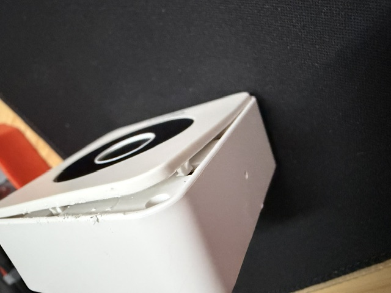
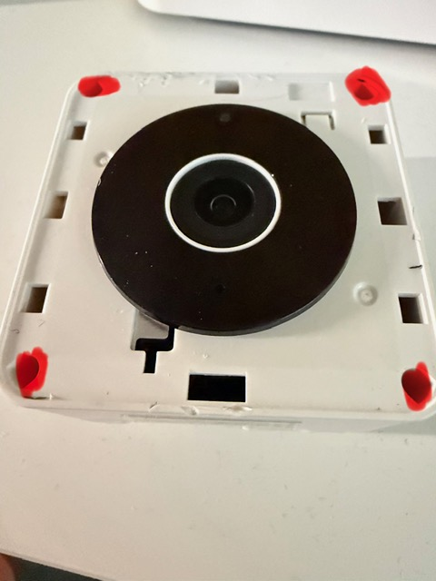
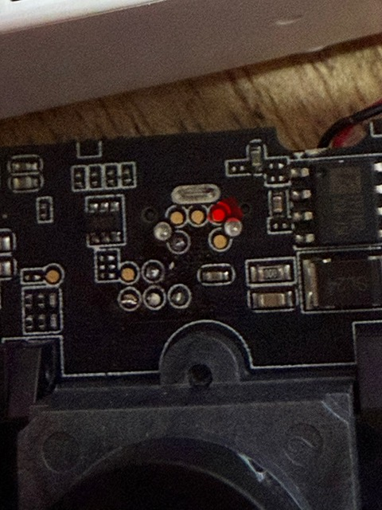

# Newer camera: S30851-H2531-R101 / Ambarella S2L

Status: **research support only; the installation and recovery procedure is
not final**.

This camera is unrelated to the original GM8126/Gen1 platform. It uses an
Ambarella S2L/S2Lm SoC and 128 MiB NAND. Never use the Gen1 SPI/MEF patcher or
MyLoader partition image on it.

> [!CAUTION]
> The development camera currently has a damaged NAND boot chain after an
> experimental Ambarella RAM loader used the reference board's partition
> geometry. It does not boot normally. The read-only dump route is validated,
> but NAND writing and bootloader restoration are not yet a user procedure.
> Do not run the experimental writer/repair scripts on another camera.

## Current support matrix

| Area | State | Notes |
| --- | --- | --- |
| Hardware identification | Documented | S30851-H2531-R101, Ambarella S2L/S2Lm |
| Local password calculator | Source implementation | Derived from stock firmware; final live-camera validation remains pending |
| Home Assistant model profile | Implemented | Snapshot/RTSP adapter exists; full hardware acceptance remains pending |
| USB BootROM access | Observed | `4255:000A`; entry is timing/contact-sensitive |
| Read-only 128 MiB NAND dump | Validated | Two-pass/hash workflow; no NAND write command required |
| Stock USB service-disk installer | Prototype | Reconstructed from firmware; not completed on a healthy camera |
| Wi-Fi fallback/setup AP | Prototype | Source overlay exists; not installed and accepted on hardware |
| NAND/rootfs writer | Unsafe experiment | Returned success without durable data; do not use |
| Bootloader recovery | In progress | Private original dump exists; restoration has not been completed |

## Opening the enclosure

Disconnect all power before opening the camera. Remove the four recessed,
poorly visible screws marked in the photograph below before separating the
housing. After removing them, work gradually with a plastic opening tool.



The red marks in the next photograph indicate the locations of the four
recessed housing screws. They are not electrical test points.



## USB-boot service pad

The **single PCB pad marked red** in the photograph below is the service pad
used during the successful Ambarella USB BootROM experiments. It was pulled to
GND through a **4.7 kOhm resistor** while RESET and power-on were sequenced.
The GND end is not marked in this photograph. Do not short the red pad directly
to ground and do not contact adjacent pads.



The observed sequence was:

1. remove camera power;
2. hold RESET and pull the marked pad to GND through 4.7 kOhm;
3. apply power;
4. release RESET after approximately 2–3 seconds;
5. wait for Ambarella USB BootROM PID `4255:000A`;
6. initialize DDR and launch the restricted BLD in RAM;
7. release the service strap only after RAM BLD PID `4255:0001` appears.

This sequence is recorded for ongoing recovery work, not presented as a
finished end-user installation method. A stable temporary resistor connection
is preferable to holding a probe by hand.

## Validated stock platform information

- Ambarella S2L/S2Lm, board profile `s2lm_ironman`;
- Ambarella Flexible Linux 2.5.0;
- 128 MiB logical NAND, 2 KiB pages and 128 KiB eraseblocks;
- lighttpd on HTTP/HTTPS with the `admin` account;
- Oryx RTSP server on port 554;
- JPEG snapshot at `/snapshot.jpg`;
- RTSP profiles `video0`, `video1`, `video2` and `video3`.

The original NAND image is private recovery material and is deliberately not
included in this repository.

## Stock credential research

The stock boot scripts recreate `/etc/webpass.txt` and `/etc/Account.txt` and
invoke `ycam_password` with the uppercase Ethernet MAC without separators. The
independent source implementation prints the expected local credentials:

```powershell
python .\ambarella_s2l\password.py 00:11:22:33:44:55
```

No firmware or camera connection is needed for the calculation. Because the
current research unit no longer reaches a normal boot, treat the result as
pending final validation on an intact camera.

## Read-only NAND acquisition

The following recovery path was validated without desoldering:

1. enter the SoC's USB BootROM;
2. initialize DDR3 from the matching S2Lm ADS profile;
3. copy a compatible BLD to RAM;
4. redirect its program, erase, receive and PTB-update commands to its own
   unknown-command handler;
5. retain only the USB GET/SEND path and route the selected GET subtype to the
   verified NAND-read routine;
6. read 128 MiB in resumable CRC-checked chunks;
7. repeat the read and compare size and SHA-256.

The RAM changes disappear at power-off. Public tooling remains source-only and
requires the user to supply compatible vendor platform archives locally; those
archives and BLD/ADS binaries are not redistributable here.

See the [read-only USB dumper notes](../../ambarella_s2l/usb_dump/README.md).

## Why the development camera no longer boots

The compatible RAM BLD reports a generic/reference-board partition table that
does not match this camera. An early experimental high-level write used that
geometry. A later comparison with the original dump found changes in NAND
blocks `0–11`, including the BST/BLD boot area, as well as other unintended
ranges. Calls also reported success even when a fresh-loader readback showed
the target data had not been programmed durably.

The on-chip Ambarella BootROM is mask ROM and was not overwritten. In
principle it remains the recovery entry point even when the NAND bootloader is
invalid. Restoration is paused until a single page can be programmed and read
back exactly through a controlled low-level path.

Planned recovery order for this one development unit is:

1. prove one-page erase/program/readback on an already blank rootfs block;
2. restore BST and BLD from the unit's verified private dump;
3. restore PBA and PRI;
4. write and verify the intended rootfs one small batch at a time;
5. restore matching PTB metadata;
6. attempt a normal cold boot only after all reads match.

No successful result should be generalized into a public installation guide
until it has also been reproduced on a second camera with independent recovery
dumps.

## Wi-Fi and local gateway prototype

Firmware analysis shows a small FAT USB service disk and a root-run
`ycam_autorun.sh` hook during normal boot. The repository contains source-only
prototypes that prepare this disk and add a local Wi-Fi recovery page. They do
not redistribute vendor firmware, but the complete path has **not** been
hardware-validated because the current camera cannot complete normal boot.

The intended behavior is:

- preserve normal configured Wi-Fi when association succeeds;
- after 30 seconds without a connection, start `Gigaset-C-XXXXXX`;
- expose setup only at `http://192.168.42.1/setup/` while that AP is active;
- keep normal station-mode pages behind stock authentication.

Treat `wifi_provision.py`, `local_gateway_install.py` and the rootfs overlay as
development sources, not as release instructions.

## Home Assistant gateway

The add-on can represent this model and is designed to derive its stock
credential, proxy `/snapshot.jpg` and convert a selected RTSP profile to MJPEG.
Automatic Oryx motion configuration and full telemetry still require testing
on a normally booting S2L camera. See the [add-on documentation](../../gigaset_elements_camera/DOCS.md).

## Publishing and recovery material

Do not commit NAND dumps, extracted filesystems, generated UBI images,
platform archives, BLD/ADS binaries, keys, certificates, MAC addresses or
device configuration. This repository contains only original source code,
documentation and contributed hardware photographs.
